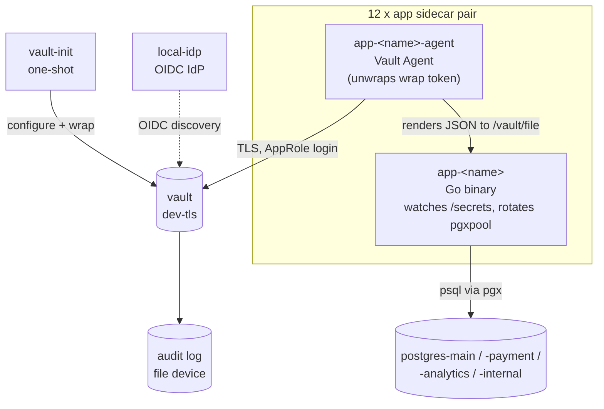

# hashicorp-vault-lab

A lab environment that reproduces a medium-sized web service organization
where multiple applications interact with HashiCorp Vault.

## Goals

- Provide a working dataplane in which 12 applications use Vault concurrently
  with the patterns a real medium-sized organization would use:
  AppRole + response wrapping, OIDC operator login, dynamic database
  credentials with pool rotation, a two-tier PKI, audit logging, and TLS.

## Non-goals

These belong in [hashicorp-vault-sandbox](https://github.com/zinrai/hashicorp-vault-sandbox):

- Vault cluster operations (HA, Raft, seal/unseal, unseal-key distribution).
- `vault operator generate-root` driven by unseal-key quorum.
- Production-grade Vault listener TLS (this lab uses Vault's `-dev-tls`
  self-signed CA; PKI hierarchy is exercised for application certificates, not
  for Vault's own listener).
- Vault version upgrades / migrations.
- Kubernetes integration.

## Architecture



### Bootstrap shape

1. `vault` starts in dev mode with TLS (`server -dev -dev-tls`). A self-signed
   CA and server cert are written to a named volume shared with all clients.
2. `vault-init` runs once: enables audit, auth methods, secrets engines, signs
   an intermediate CA, rotates database root credentials, defines policies and
   AppRole/OIDC roles, populates KV secrets, **response-wraps every per-app
   role-id and secret-id** (TTL 600s), and finally **revokes the root token**.
3. Each `app-<name>-agent` starts after `vault-init` exits. Its entrypoint
   unwraps the two wrap tokens, writes the resulting role-id / secret-id to a
   per-container tmpfs, and exec's `vault agent`. The wrap token is single-use:
   if the agent container restarts, unwrap fails and the agent does not start.
   This is the intended real-env behaviour. Re-provisioning requires re-running
   `vault-init` (the orchestrator's job in production).
4. Each `app-<name>` is the same Go binary, parameterised by
   `apps/<name>.yaml`. It watches `/secrets/*.json` written by its Agent
   sidecar, rebuilds its `pgxpool` on credential rotation, and emits
   structured JSON logs with the current username, lease id, and lease TTL.

### Operator workflow

The root token is revoked at the end of `vault-init`. Operators authenticate
via OIDC against `local-idp`:

```sh
docker compose cp vault:/vault/tls/vault-ca.pem ./ca.pem
export VAULT_ADDR=https://localhost:8200
export VAULT_CACERT=$PWD/ca.pem
export VAULT_TLS_SERVER_NAME=localhost

vault login -method=oidc role=sre        # user 'sre' / 'srepass'
vault login -method=oidc role=developer  # user 'developer' / 'devpass'
```

`sre` maps to `sre-admin` policy (broad read/list across mounts); `developer`
maps to `developer-readonly` (KV reads only).

## Quick start

```sh
docker compose up -d
docker compose ps vault-init        # STATUS should be "Exited (0)"
```

Set up an operator session:

```sh
docker compose cp vault:/vault/tls/vault-ca.pem ./ca.pem
export VAULT_ADDR=https://localhost:8200
export VAULT_CACERT=$PWD/ca.pem
export VAULT_TLS_SERVER_NAME=localhost
vault login -method=oidc role=sre
```

Snapshot the lab:

```sh
./check-status.sh
```

For feature-by-feature inspection commands (AppRole / OIDC / KV / dynamic
DB / PKI / audit / disruption experiments), see [EXPLORING.md](EXPLORING.md).
For the reasoning behind the lab's shape and its scope boundary with
`hashicorp-vault-sandbox`, see [DESIGN.md](DESIGN.md).

Observe an application in real time:

```sh
docker compose logs -f app-api-server         # JSON: db check, kv state
docker compose logs -f app-api-server-agent   # Agent auth, template renders
```

Tail the audit log:

```sh
docker compose exec vault tail -f /vault/logs/audit.log
```

## Components

### Applications (12)

| # | Name              | Vault inputs                                                  |
|---|-------------------|---------------------------------------------------------------|
| 1 | web-frontend      | KV `secret/config`, DB `main-readonly`                        |
| 2 | api-server        | KV `secret/api-server/*`, DB `main-readwrite`                 |
| 3 | admin-panel       | DB `main-readonly`, PKI `admin-panel` (issued by `pki_int`)   |
| 4 | auth-service      | KV `secret/auth-service/*`, DB `main-readwrite`               |
| 5 | payment           | KV `secret/payment/*`, DB `payment-short` (10m TTL)           |
| 6 | notification      | KV `secret/notification/*`                                    |
| 7 | search            | DB `main-readonly`                                            |
| 8 | batch-runner      | DB `main-readwrite`, DB `analytics-readwrite`                 |
| 9 | etl               | DB `main-long` (8h TTL), DB `analytics-readwrite`             |
| 10| analytics         | DB `analytics-readonly`                                       |
| 11| webhook-receiver  | KV `secret/webhook-receiver/*`, DB `main-readwrite`           |
| 12| internal-cms      | KV `secret-internal/internal-cms/*`, DB `internal-readwrite`  |

Each application is a pair of containers sharing a per-app named volume:

- `app-<name>-agent` (`hashicorp/vault:2.0.2`) runs `vault agent` after
  unwrapping its bootstrap wrap tokens. Reads `vault-agent-configs/<name>.hcl`
  (Vault address, TLS verification, AppRole auto-auth, inline template blocks
  that emit JSON files per credential source).
- `app-<name>` (locally built from `./app`) runs the lab's single Go binary
  with `apps/<name>.yaml`. The binary watches the rendered JSON files at
  `/secrets/*.json` and rotates its `pgxpool` / KV state / PKI cert observation
  on file change.

### Vault configuration

- **Listener**: TLS via `-dev-tls`; CA shared through the `vault-tls` volume.
- **Audit**: file device at `/vault/logs/audit.log` (volume `vault-audit`).
- **Auth methods**: `approle/` (machines), `oidc/` (humans).
- **Secrets engines**: `secret/` (KV v2), `secret-internal/` (KV v2),
  `database/` (max-lease-ttl 24h), `pki/` (root), `pki_int/` (intermediate).
- **PKI**: two-tier. `pki/` issues only the intermediate CA cert;
  `pki_int/admin-panel` issues 1h application certificates.
- **Policies**: `base` (token lifecycle), `sre-admin`, `developer-readonly`,
  and one policy per application.
- **OIDC roles**: `sre` → `sre-admin`, `developer` → `developer-readonly`.
- **AppRole roles**: one per application, `token_ttl=20m`, `token_max_ttl=2h`,
  `secret_id_ttl=720h`, `secret_id_num_uses=0`.
- **Database connections**: `postgres-main`, `postgres-payment`,
  `postgres-analytics`, `postgres-internal`. Vault rotates its own connection
  password during init (`database/rotate-root/*`), so the seed credentials
  posted in `vault-init/init.sh` are immediately invalidated.
- **Database roles**: `main-readonly`, `main-readwrite`, `main-short` (15m),
  `main-long` (8h), `payment-short` (10m), `analytics-readonly`,
  `analytics-readwrite`, `analytics-long`, `internal-readwrite`.

### Bootstrap volume

`vault-bootstrap` is shared between `vault-init` (writer) and the 12 agent
containers (read-only). `vault-init` writes per-app wrap tokens at
`/vault-bootstrap/<app>/{role-id.wrap, secret-id.wrap}`. Each agent
`entrypoint.sh` unwraps once, persists role-id / secret-id to a per-container
tmpfs (`/vault-creds`), and exec's `vault agent`. The wrap is consumed in
that step. Container restart re-runs the entrypoint, the wrap unwrap fails,
and the agent does not start - this is intentional.

## Observing dynamic credential rotation

```sh
docker compose logs -f app-payment
# payment uses payment-short (default_ttl=10m). Wait ~5min, watch for:
# {"level":"INFO","msg":"db pool rotated", ...}
```

`payment` is the smallest observation window (10m). `etl` exercises the long
end (`main-long`, 8h). `check-status.sh` summarises active lease counts per
role; if you run `docker compose up -d` and wait 30 minutes before re-running
the script, the lease counts trace the rotation cadence of each role.

## Lab simplifications

The following diverge from a production deployment but are deliberate scope
choices for the lab:

- Vault runs in `-dev-tls` mode: in-memory storage, auto-unsealed, root token
  regenerates on restart (we revoke it after bootstrap to demonstrate the
  operational shape, not because the revocation persists).
- All containers run as root. Production Vault Agent + app sidecars would use
  distinct UNIX users with file-perms-based isolation; the rendered files
  here use `perms = "0400"` but live under root ownership. The file-rather-
  than-env-var pattern (the actual real-env teaching point) is preserved.
- Postgres connections from apps to databases use `sslmode=disable`. A
  production setup would terminate TLS at the database listener as well.
- `local-idp` is a minimal OIDC provider; group claims and external-group
  mapping are not exercised.

## Stopping the lab

```sh
docker compose down -v
```

`-v` removes named volumes (`vault-tls`, `vault-audit`, `vault-bootstrap`,
the 12 `<app>-rendered` volumes). Because Vault runs in dev mode, restarting
the lab resets all state.

## License

This project is licensed under the [MIT License](./LICENSE).
