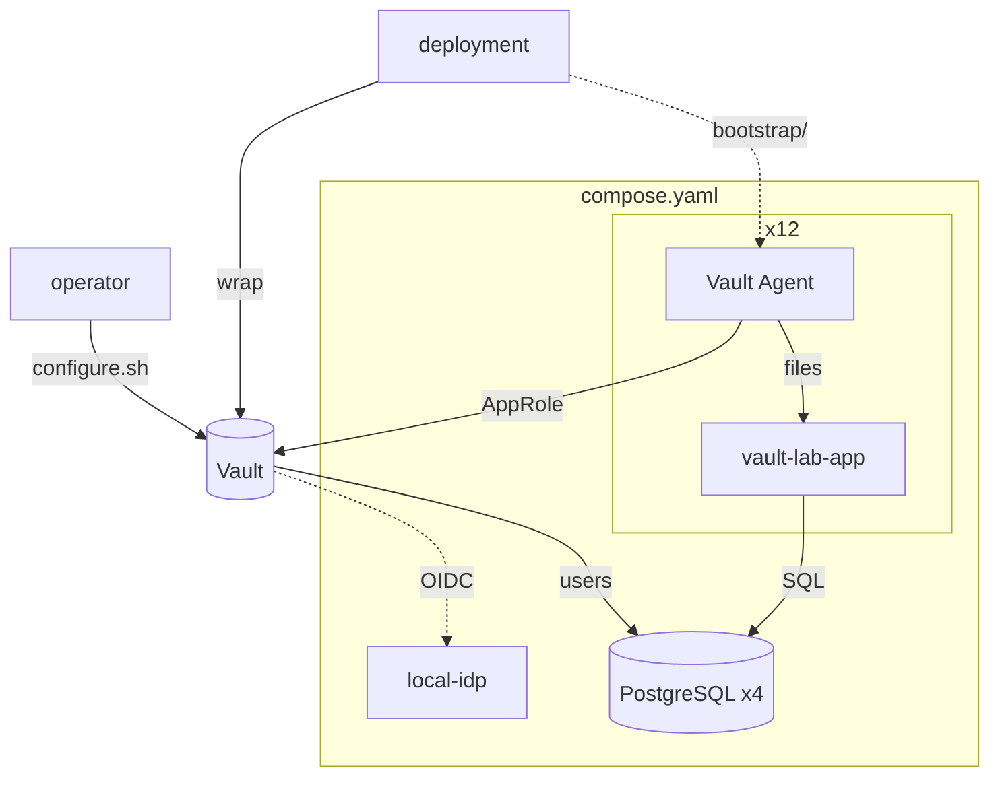

# Architecture

What the lab is made of: its containers, what each application takes from
Vault, and what `configure.sh` writes. To bring it up, see the
[README](../README.md). Why it has this shape is in [RATIONALE](RATIONALE.md).

## The picture

The Vault is not part of the lab. It is reached at `VAULT_ADDR` and verified
against `VAULT_CACERT`, and it keeps its own audit log. An operator of that
Vault runs `vault-config/configure.sh` with their own token. The deployment,
played by `wrap` in the README, then response-wraps each application's
role-id and a new secret-id into `bootstrap/<app>/`. Each agent unwraps its
pair once at first start, keeps the values in a tmpfs at `/vault-creds`, and
starts `vault agent`.

## Containers

Every container joins `VAULT_NETWORK`, the Docker network the Vault nodes are
on, so the nodes reach the databases and `local-idp` by name.

- Without a profile: four PostgreSQL databases (`postgres-main`,
  `postgres-payment`, `postgres-analytics`, `postgres-internal`) and
  `local-idp`.
- Profile `apps`: twelve pairs. In total the lab runs 29 containers.

Each pair shares a named volume, `<name>-rendered`:

- `app-<name>-agent` runs Vault Agent with `vault-agent-configs/<name>.hcl`.
  It writes its token to `/tmp/token` and renders secrets as JSON files, mode
  `0400`, into the shared volume.
- `app-<name>` runs `vault-lab-app`, one Go binary built from `app/` and
  configured by `apps/<name>.yaml`. It reads the rendered files under
  `/secrets/` and checks them once a second. When a file changes, it rebuilds
  its PostgreSQL pool, reloads its KV values, or parses its new certificate.
  It logs JSON: `db check ok`, `db pool rotated`, `kv state`, `pki state`.

## Applications

| # | Name | KV | Database role | PKI |
|---|------|----|---------------|-----|
| 1 | web-frontend | `secret/config` | `main-readonly` | |
| 2 | api-server | `secret/api-server/config` | `main-readwrite` | |
| 3 | admin-panel | | `main-readonly` | `pki_int/issue/admin-panel` |
| 4 | auth-service | `secret/auth-service/jwt-key` | `main-readwrite` | |
| 5 | payment | `secret/payment/stripe` | `payment-short` | |
| 6 | notification | `secret/notification/sendgrid`, `secret/notification/webhook` | | |
| 7 | search | | `main-readonly` | |
| 8 | batch-runner | | `main-readwrite`, `analytics-readwrite` | |
| 9 | etl | | `main-long`, `analytics-readwrite` | |
| 10 | analytics | | `analytics-readonly` | |
| 11 | webhook-receiver | `secret/webhook-receiver/secret` | `main-readwrite` | |
| 12 | internal-cms | `secret-internal/internal-cms/config` | `internal-readwrite` | |

Every application is its own AppRole subject, with its own policy in
`vault-config/policies/<name>.hcl`. Several share a database role. These are
two different axes of granularity; see
[DECIDING 2](DECIDING.md#2-what-counts-as-one-subject).

## Database roles

| Role | Database | Access | default_ttl | max_ttl | Used by |
|------|----------|--------|-------------|---------|---------|
| `main-readonly` | postgres-main | read | 1h | 24h | web-frontend, admin-panel, search |
| `main-readwrite` | postgres-main | read, write | 1h | 24h | api-server, auth-service, batch-runner, webhook-receiver |
| `main-short` | postgres-main | read, write | 15m | 15m | none |
| `main-long` | postgres-main | read | 8h | 24h | etl |
| `payment-short` | postgres-payment | read, write | 10m | 10m | payment |
| `analytics-readonly` | postgres-analytics | read | 1h | 24h | analytics |
| `analytics-readwrite` | postgres-analytics | read, write | 1h | 24h | batch-runner, etl |
| `analytics-long` | postgres-analytics | read | 8h | 24h | none |
| `internal-readwrite` | postgres-internal | read, write | 1h | 24h | internal-cms |

Each lease is a PostgreSQL role named `v-...`, valid until the lease expires.

## People and their roles

`local-idp` is [Dex](https://dexidp.io/), configured by
`local-idp/config.yaml`, with two users: `sre@example.local` / `srepass` and
`developer@example.local` / `devpass`. Either user may select any of the three
OIDC roles:

| OIDC role | Policy | Token TTL (max) | Can look | Can stop | Can change what gets issued |
|-----------|--------|-----------------|----------|----------|-----------------------------|
| `developer` | `developer-readonly` | 8h (24h) | KV values in `secret/` | no | no |
| `sre` | `sre-admin` | 8h (24h) | broadly, KV metadata but not values | no | no |
| `incident` | `incident-response` | 30m (1h) | enough to pick a target | yes | no |
| none: the Vault's operators | their own | their own | broadly | yes | yes |

"Change what gets issued" means writing `sys/policies/acl/*` or
`auth/*/role/*`.

## What configure.sh writes

`vault-config/configure.sh` runs with the operator's token and is safe to run
again. It does not enable audit, does not use a root token, and does not issue
secret-ids.

- Auth methods: `approle/` for applications, `oidc/` for people, pointing at
  `local-idp`, with the three roles above.
- AppRole roles: one per application, with
  `token_policies="self-renewal,<app>"`, `token_no_default_policy=true`,
  `token_ttl=20m`, `token_max_ttl=2h`.
- Secrets engines: `secret/` and `secret-internal/` (KV v2), `database/`,
  `pki/` (root CA) and `pki_int/` (intermediate CA).
- PKI: the role `pki_int/roles/admin-panel` allows subdomains of
  `lab.example.local`, up to 24h. The admin-panel agent asks for 1h
  certificates.
- Database connections: one per database. Each is written once, and Vault
  then rotates its own password at the database.
- Database roles and policies: as above, one policy per application plus
  `self-renewal`, `sre-admin`, `developer-readonly` and `incident-response`.
- KV values: one or two per application that uses KV, all dummies.
