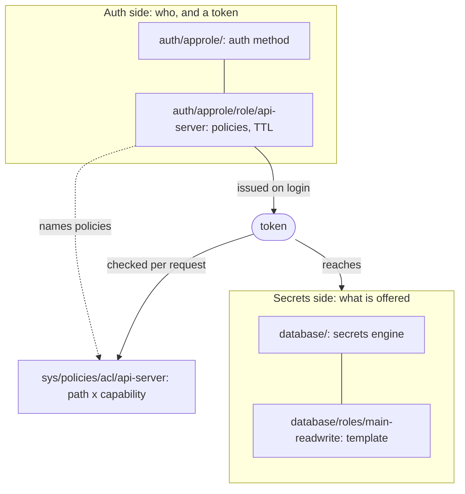
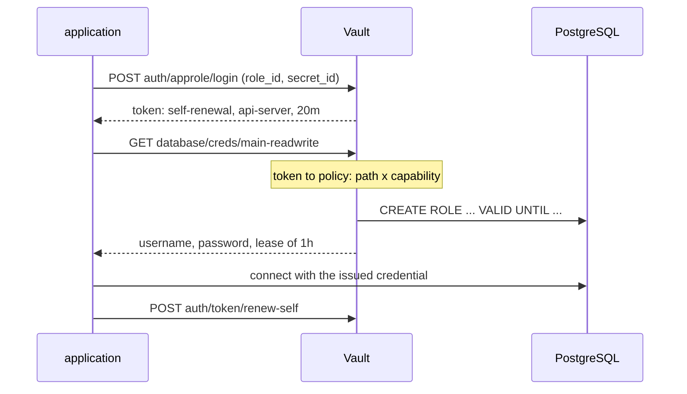
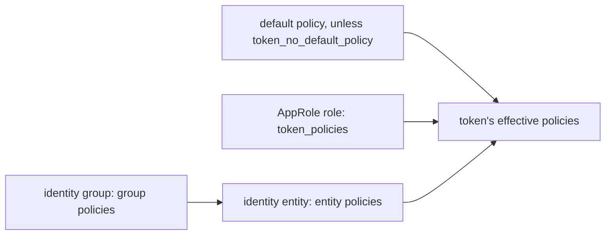
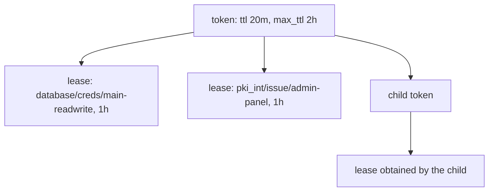

# Concepts

How Vault works, at the level needed to read its documentation and to make the
decisions in [DECIDING.md](DECIDING.md).

Examples use the names this lab actually uses, so the commands here run against
a running lab.

## How to use this document

Five things are worth holding in your head. Everything else is worth looking up.

1. [It solves revocation, not storage](#what-vault-solves)
2. [Auth side to token to policy to secrets side](#structure)
3. [Granularity comes from subjects, not from policy detail](#granularity-comes-from-subjects)
4. [Three different things can be stolen, and the answer differs](#what-happens-when-something-is-stolen)
5. [Some paths have side effects on `read`](#reading-the-official-documentation)

Everything through
[What this document does not settle](#what-this-document-does-not-settle) is
meant to be read once, in order. [Reference](#reference) is the path namespace
and the capability list, and is meant to be looked up.

## What Vault solves

Not storage. **Revocation.**

With a static credential, a leak means:

1. Change the password
2. Find every application that references it
3. Edit the configs
4. Redeploy in order
5. Confirm nothing was missed

The work scales with the number of references, and anything missed keeps
working. Vault replaces this with **keep a record of what was issued, then walk
the record and take it back**.

Every major mechanism follows from that one goal:

- To record who was given what, issuance is funnelled through Vault (secrets engines)
- Records carry a unit called a **lease**, which is what gets taken back
- Leases and tokens carry a **TTL**, so a forgotten revocation still ends
- Tokens and leases form a **parent/child tree**, so cutting the root drops the branches
- Issuance is preceded by authentication, so the record has an owner (auth methods)
- **Policies** declare who may be issued what

Starting from "Vault stores secrets safely" makes it look like an encrypted
shared password store with an API. Under that reading, leases and TTLs and
token parentage are unmotivated ceremony.

## Structure

Two halves, joined by policy. The auth side issues a token, the token reaches
the secrets side.



### Auth side

- Mount an auth method (`sys/auth/<path>`)
- Configure its link to the external identity source (`auth/<path>/config`)
- Define a role (`auth/<path>/role/<name>`) holding the login conditions, the
  list of policy names to attach, and the token TTL
- `auth/<path>/login` returns a token

**The unit of token issuance is this role**, not the policy.

### Secrets side

- Mount a secrets engine (`sys/mounts/<path>`)
- Configure its link to the target system (`<path>/config/<name>`)
- Define an issuance template (`<path>/roles/<name>`)
- Each call to `<path>/creds/<name>` or `<path>/issue/<name>` generates a new credential
- KV is the exception. It returns the value you put at `secret/data/<path>`

### Policy

Stored at `sys/policies/acl/<name>`. It declares what may be done at which
paths.

A policy is not attached to a path. The policy asserts, from its own side, that
it may read `secret/data/api-server/*`. The direction of reference is the
opposite of what most people assume, and it is the first thing that trips
people up.

```hcl
path "secret/data/api-server/*" {
  capabilities = ["read"]
}

path "database/creds/main-readwrite" {
  capabilities = ["read"]
}
```

## Reading the official documentation

The official documentation is hard to enter without the shape above. Concretely:

- Auth methods and secrets engines are introduced side by side, so it is not
  obvious which half you are currently reading about
- `role` names two different things and is never disambiguated
- Paths look flat, so the levels of meaning are not visible
- Nothing in the shape of `database/creds/main-readwrite` reveals that reading
  it creates a user in Postgres
- KV v1 and v2 use different paths (`secret/foo` versus `secret/data/foo`), and
  `vault kv put` hides the `data/`, so the CLI and the HTTP API disagree
- Where a token's policies came from (role, entity, or default) is not stated
- The relationship between tokens and leases is not spelled out
- Enterprise-only features are mixed in without a clear boundary

Being able to decompose paths is what makes the documentation readable. The
namespace itself, and the vocabulary that repeats inside each mount, are in
[Reference](#reference).

### Decomposing a path

`database/creds/main-readwrite` carries three separate facts.

- `database` is **the name it was mounted under**, not the engine type
- `creds` is an **API entry point** that issues dynamic credentials. Each read produces a new one
- `main-readwrite` is the **issuance template** defined at `database/roles/main-readwrite`

The first segment being a chosen name rather than a type matters.
`vault secrets enable -path=pg database` puts the same engine at
`pg/creds/main-readwrite`. `secret/` is likewise just the name KV v2 was
mounted under.

Two things follow that are worth knowing before the reference tables.

**`role` names two different things.** On the auth side it is a login profile,
on the secrets side it is a credential template. The official documentation
calls both `role` and never disambiguates, so every time you read one you have
to work out which.

**Paths that look alike behave differently.** Some are configuration you write
once, some hold values, and some generate something on every call, which means
**`read` can have side effects**. `database/creds/main-readwrite` creates a
Postgres user each time it is read. Both distinctions are tabulated in
[Reference](#reference).

### Some paths ignore policy entirely

A handful of endpoints are unauthenticated by design and answer regardless of
what any policy says. The PKI CA endpoints are the ones you meet first:

```sh
vault write sys/capabilities-self paths=pki/cert/ca
# capabilities [deny]

VAULT_TOKEN= vault read -field=certificate pki/cert/ca
# -----BEGIN CERTIFICATE-----
```

The policy denies it, the read succeeds, and both are correct. Serving a CA
certificate to anyone who asks is the point of a CA. Login endpoints behave the
same way, which is why `auth/approle/login` works before you hold a token.

The trap is diagnostic rather than security-related. `sys/capabilities-self`
reports what the ACL grants, not what the request will do, so it can say `deny`
for something that works and it can say `read` for something that will still be
refused because the path is root-protected and the token lacks `sudo`.
**Neither direction is a reliable predictor. Issue the request.**

## Getting a secret out

KV is retrieval. Everything else is issuance. This distinction is the centre of
Vault.

KV returns what was put there. Read it twice, get the same thing.

```
$ vault login -method=oidc role=developer
$ vault kv get -field=max-connections secret/api-server/config
100

$ vault kv get -field=max-connections secret/api-server/config
100
```

The `developer` role is required here. `sre-admin` holds `secret/metadata/*`
but not `secret/data/*`, so an SRE session can list which secrets exist and
cannot read their values. That is deliberate, see
[RATIONALE](RATIONALE.md#operators-can-see-the-shape-of-kv-not-its-contents).

A database credential is built on each read.

```
$ vault read database/creds/main-readwrite
Key                Value
---                -----
lease_id           database/creds/main-readwrite/8Tn2vFqXhL0pR3sK9wYc1mBd
lease_duration     1h
lease_renewable    true
password           A1a-8xQvKzR2mPwL4nTe
username           v-approle-main-readwr-Xk9mQ2vP1nRs-1756604102

$ vault read database/creds/main-readwrite
Key                Value
---                -----
lease_id           database/creds/main-readwrite/pQ7mZx3JnV8tK1sD5wRbGh
lease_duration     1h
lease_renewable    true
password           B2b-3yTwMxS5nQzN7pUf
username           v-approle-main-readwr-Yb4pT8wK6mNv-1756604117
```

Different `lease_id`, different `username`. Reading alone added two users to
Postgres.

```
$ docker exec postgres-main psql -U vault-admin -d postgres \
    -c "SELECT rolname, rolvaliduntil FROM pg_roles WHERE rolname LIKE 'v-%'"
```

What the word `read` suggests and what actually happens do not line up. No
diagram conveys this. Running it twice does.

### The runtime sequence



## Controlling what can be reached

### Granularity comes from subjects

However finely a policy is written, if one credential is shared by three
applications the granularity is not there. If the subjects are separate, a
coarse policy still separates blast radius.

**What actually sets granularity is how you decide what counts as one subject.**
That is a question about your deployment units, not about Vault, and it is
[decision 2](DECIDING.md#2-what-counts-as-one-subject).

### Granularity has a space axis and a time axis

- **Space**: which paths, at which capabilities
- **Time**: how long tokens and leases stay valid

Static secret management has no time axis. Having one is half the reason to use
Vault.

### Capability names do not describe the effect

Granting `read` on `database/creds/main-readwrite` is, in effect, granting the
ability to create users in Postgres. Granting `create` on `pki_int/issue/*`
issues certificates. Granting `update` on `transit/decrypt/*` decrypts
ciphertext.

Estimating exposure from capability names alone gets it wrong. For anything that
generates something on read, check what the call actually does.

The full capability list, and how Vault picks between overlapping path rules,
are in [Reference](#reference).

### A token's policies arrive from more than one place

This is why `vault token lookup` prints `policies`, `token_policies`, and
`identity_policies` separately.



Reading the role alone does not tell you what a token carries.

## What happens when something is stolen

Three different things can be taken, and the consequences differ. Mixing them
up makes the conversation incoherent.

| Stolen | Equivalent to | Consequence |
|--------|---------------|-------------|
| A token | A visitor badge that expires in 20 minutes | Ends on its own. Can be ended sooner |
| A credential such as a SecretID | The employee card used to obtain badges | Ending the badge changes nothing. New ones can be drawn indefinitely |
| Write access to issuance settings | Being able to edit the register of who gets which badge | Disables both of the above |

### A token alone

The ceiling on damage is the remaining TTL. It cannot be extended past
`token_max_ttl`, and drawing a new one needs the underlying credential, so it
ends when the token ends.

Revoking a token revokes the leases it obtained and its child tokens. TTL
expiry takes the same path: the token and its leases are revoked.



A lease's TTL is independent of the token's. Above, the token lasts 20 minutes
and the database credential an hour. Stopping the token still drops the branch.

Tokens issued through an auth method are normally orphans, so one application's
revocation does not take others with it.

### The underlying credential

Revoking tokens accomplishes nothing. The holder logs in again. The only way to
stop it is to close issuance.

### Write access to issuance settings

A token that can write `sys/policies/acl/*` or `auth/*/role/*` can, inside a
20-minute TTL, rewrite which policies a role hands out. The original token dies
and the rewritten role keeps issuing. **Bounding damage by time stops working
at this one point.**

Who holds this is [decision 6](DECIDING.md#6-who-can-change-issuance-settings).

### Stopping things

| Goal | Command | Effect |
|------|---------|--------|
| Stop one token | `vault token revoke -accessor <accessor>` | That token, its leases, its children |
| Stop what one engine issued | `vault lease revoke -prefix database/creds/` | Every credential under the prefix |
| Stop issuance | `vault delete auth/approle/role/api-server` | No further logins. Existing tokens survive |
| Close an entire auth path | `vault auth disable approle` | Revokes every token that method issued |

Revocation uses the accessor rather than the token because the accessor carries
no authority of its own. Accessors appear in the audit log and tokens do not.
**Without an audit device there is no way to identify which token to stop.**

### What revocation does not do

Revoking a dynamic credential tells the target system to remove it. For the
database engine that means the Postgres role is dropped, and any new connection
using it fails.

**It does not terminate sessions already established with that credential.**
Postgres keeps serving an open connection whose role has been dropped, so an
application holding a connection pool carries on unaffected. The Vault Agent is
not notified either. It finds out at its next renewal attempt, which for a
one-hour lease is around forty minutes later.

Revocation therefore bounds *drawing new access*, not access already in flight.
Against an attacker who already holds an open connection, revocation alone is
not enough and the session has to be killed at the target. This is observable
in the lab, see
[EXPLORING 4](EXPLORING.md#4-dynamic-database-credentials-the-headline-feature).

## Getting the first credential in

The credential used to reach Vault also has to live somewhere. Vault's answer
is not a better hiding place. It is **to replace it with something that is
useless to anyone but the intended holder**.

Where the platform already vouches for the identity, nothing has to be
distributed at all. Where it does not, AppRole is the fallback and the
distribution is yours to solve. That trade-off is
[decision 3](DECIDING.md#3-how-subjects-authenticate).

RoleID may sit in a config file, because it cannot log in alone. SecretID is
handed over with response wrapping:

```
$ vault write -wrap-ttl=60s -f auth/approle/role/api-server/secret-id
Key                Value
---                -----
wrapping_token     hvs.CAESIJ...
wrapping_ttl       60s
```

Only the wrapping token comes back. The SecretID is not in it. The recipient
unwraps to get the value, and the wrapping token is spent:

```
$ vault unwrap hvs.CAESIJ...
```

If anyone unwrapped it in transit, the intended recipient's unwrap fails.
**There is no state in which you cannot tell whether it leaked.** TLS encrypts
the channel but says nothing about what happened after receipt.

This lab uses exactly this mechanism, so its running cost is visible. See
[EXPLORING 1](EXPLORING.md#1-approle--response-wrap-machine-authentication).

## What this document does not settle

Being able to read every path fluently will not tell you what counts as one
subject in your environment. It is not a comprehension problem, so no amount of
detail here moves it.

Vault's configuration is a mapping of how your organization decides who may
reach what. In most organizations that is implicit, and adopting Vault is the
work of writing it down.

What has to be decided is in [DECIDING.md](DECIDING.md). Whether the decisions
were right does not surface anywhere in daily operation until something leaks,
which is what this lab is for.

## Reference

Lookup material. Nothing below is needed to follow the sections above.

### The namespace

- `sys/` Vault's own structure
    - `sys/auth/*`, `sys/mounts/*` mount operations
    - `sys/policies/acl/*` the policies themselves
    - `sys/leases/*` operations on issued leases
    - `sys/audit/*` audit devices
- `auth/<mount>/` the auth side
    - `auth/approle/config` link to the identity source
    - `auth/approle/role/*` login profiles
    - `auth/approle/login` token issuance
    - `auth/token/*` operations on tokens themselves
- `<mount>/` the secrets side, first segment is the mount name
    - `database/config/*` link to the target
    - `database/roles/*` issuance templates
    - `database/creds/*` credential issuance
    - `secret/data/*`, `secret/metadata/*` KV values and metadata
- `identity/` entities and groups

Within a mount, the same words recur with the same meaning.

| Word | Meaning |
|------|---------|
| `config` | link between this mount and an external system |
| `role`, `roles` | a declaration. Means different things on each side |
| `login` | token issuance |
| `creds`, `issue` | credential issuance |
| `data`, `metadata` | KV values and metadata |

### `role` names two different things

| Official term | Read it as | Contents | Example |
|---------------|------------|----------|---------|
| Auth method role | login profile | who may log in, and what token comes out | `auth/approle/role/api-server` |
| Secrets engine role | credential template | how a credential is built | `database/roles/main-readwrite` |

The documentation calls both `role`, so every time you read one you have to
work out which. In the paths, the auth side uses singular `role/` and the
secrets side uses plural `roles/`, with `auth/token/roles/` as the exception.

### Four kinds of path

Paths look alike. What a read or write does to them does not.

| Kind | Behaviour | Examples |
|------|-----------|----------|
| Configuration | Written once and stays. Reads return what was written | `sys/policies/acl/api-server`, `auth/approle/role/api-server`, `database/config/postgres-main`, `database/roles/main-readwrite` |
| Value | Returns the value that was put there | `secret/data/api-server/config` |
| API entry point | Generates something on each call. **`read` has side effects** | `auth/approle/login`, `database/creds/main-readwrite`, `pki_int/issue/admin-panel` |
| Window on state | Shows what runtime produced | `sys/leases/lookup/*`, `auth/token/lookup-accessor` |

### Capabilities

| Capability | HTTP | Meaning |
|------------|------|---------|
| `create` | POST/PUT | create |
| `read` | GET | read |
| `update` | POST/PUT | modify |
| `patch` | PATCH | partial update |
| `delete` | DELETE | delete |
| `list` | LIST | enumerate |
| `sudo` | | reach root-protected paths |
| `subscribe` | | subscribe to events |
| `recover` | | recover from a snapshot |
| `deny` | | refuse |

`deny` beats everything else, including `sudo`.

When several path rules match, **the more specific one wins**. Not the longest
match: the ordering is by whether the rule ends in `*`, how many `+` segments
it has, and where they sit. `secret/+/+/foo/*` outranks `secret/*`.

https://developer.hashicorp.com/vault/docs/concepts/policies
