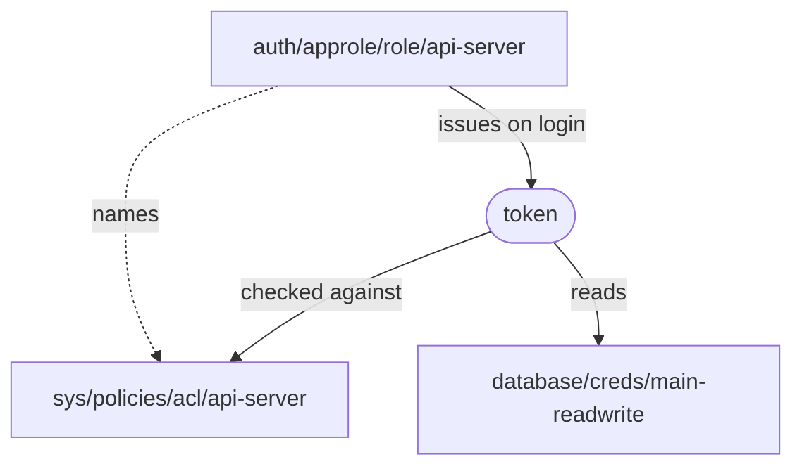
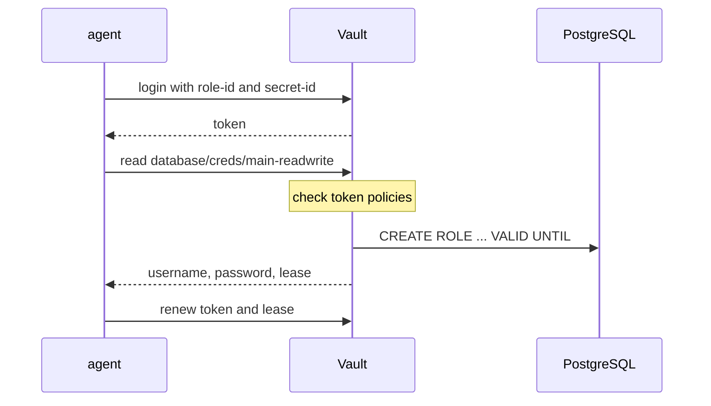

# Concepts

The Vault vocabulary needed to read [DECIDING](DECIDING.md). Read it once if
Vault is new to you, and skip it if not. Examples use the lab's own names, so
you can try them against the running lab. The [Reference](#reference) at the
end is for looking things up.

## What Vault solves

Not storage. Revocation.

With a static credential, a leak means: change the password, find every
application that uses it, edit their configuration, and redeploy. Anything
missed keeps working. Vault instead keeps a record of what it issued, and takes
it back by walking the record.

The main mechanisms follow from that goal:

- Issuance goes through Vault (secrets engines), so there is a record.
- Each record carries a **lease**, which is what gets taken back.
- Leases and tokens carry a **TTL**, so a forgotten revocation still ends.
- Issuance follows authentication (auth methods), so each record has an owner.
- **Policies** declare who may be issued what.

## Structure

Two halves, joined by policy. The auth side issues a token, and the token
reaches the secrets side.



**Auth side.** An auth method is mounted under `auth/`. A role
(`auth/<mount>/role/<name>`) holds the login conditions, the policies to
attach and the token TTL. A login at `auth/<mount>/login` returns a token. The
unit of token issuance is this role, not the policy.

**Secrets side.** A secrets engine is mounted at a path. Its link to a target
system is `<mount>/config/<name>`, and a credential template is
`<mount>/roles/<name>`. Each call to `<mount>/creds/<name>` or
`<mount>/issue/<name>` creates a new credential. KV is the exception: it
returns the value you stored.

**Policy.** Stored at `sys/policies/acl/<name>`, it says what may be done at
which paths. The policy claims paths from its own side; nothing is attached to
the path. This is `vault-config/policies/api-server.hcl`:

```hcl
path "secret/data/api-server/*" {
  capabilities = ["read"]
}

path "database/creds/main-readwrite" {
  capabilities = ["read"]
}
```

## Reading a path

`database/creds/main-readwrite` carries three facts:

- `database` is where the engine was mounted, not its type. `secret/` is
  likewise just where KV v2 was mounted. `vault secrets list` shows both.
- `creds` is an entry point that issues a new credential on every read.
- `main-readwrite` is the template at `database/roles/main-readwrite`.

Three traps follow.

**`role` means two things.** On the auth side it is a login profile. On the
secrets side it is a credential template. See
[Reference](#role-means-two-things).

**`read` can have side effects.** Reading `database/creds/main-readwrite`
creates a PostgreSQL user, so granting `read` there grants the right to create
users. Judge exposure by what the call does, not by the capability name.

**What the ACL says is not what the request does.** `sys/capabilities-self`
reports what the ACL grants. Some endpoints answer anyone, by design: login
endpoints, and the PKI CA:

```sh
vault login -method=oidc role=developer
vault write -f sys/capabilities-self paths=pki/cert/ca   # [deny]
VAULT_TOKEN= vault read -field=certificate pki/cert/ca   # -----BEGIN CERTIFICATE-----
```

`verify.py` checks both halves. The opposite also happens: root-protected
paths need `sudo` on top of the ACL, as described under
[Root protected API endpoints](https://developer.hashicorp.com/vault/docs/concepts/policies#root-protected-api-endpoints).
To know whether a request works, issue it.

One more: KV v2 stores values under `data/`. `vault kv get
secret/api-server/config` reads `secret/data/api-server/config`, and policies
name the second form.

## Getting a secret out

KV is retrieval. Everything else is issuance.

KV returns what was put there. Read it twice, get the same value. A database
credential is built on each read: two reads of `database/creds/main-short`
return two lease IDs and two PostgreSQL users. Try both:
[KV v2](EXPLORING.md#3-kv-v2) and
[Read credentials by hand](EXPLORING.md#read-credentials-by-hand).

What an application does, through its agent:



## Tokens and policies

A token may do the union of what its policies allow. There is no inheritance,
so nothing can narrow a grant made in another policy. Vault adds its built-in
`default` policy unless the role sets `token_no_default_policy`. In this lab an
application token carries `[api-server self-renewal]` and a person's carries
`[default sre-admin]`. How `deny` and overlapping paths combine is in
[Policies](https://developer.hashicorp.com/vault/docs/concepts/policies).

## What can be stolen

Three different things can be taken, and the consequences differ.

| Stolen | Consequence |
|--------|-------------|
| A token | Ends on its own at its TTL, and can be revoked sooner |
| The credential behind it, such as a SecretID | Revoking tokens changes nothing; the holder logs in again. Only closing issuance stops it |
| Write access to issuance settings | Defeats both of the above |

An application token here lives 20 minutes, renewable up to 2 hours. The
leases a token obtained are revoked with it; see
[Tokens](https://developer.hashicorp.com/vault/docs/concepts/tokens) and
[Leases](https://developer.hashicorp.com/vault/docs/concepts/lease).

Write access to issuance settings means writing `sys/policies/acl/*` or
`auth/*/role/*`. Within its own short TTL, such a token can change which
policies a role hands out, and the changed role keeps issuing after the token
dies. Who holds this is
[decision 6](DECIDING.md#6-who-can-change-issuance-settings).

Two commands stop what the lab issued, and both run in
[EXPLORING](EXPLORING.md#4-dynamic-database-credentials):

| Goal | Command |
|------|---------|
| Stop one credential | `vault lease revoke <lease_id>` |
| Stop everything under a prefix | `vault lease revoke -prefix database/creds/main-readwrite` |

Revoking a database lease drops the PostgreSQL user, so new logins fail. It
does not close connections already open.

## Getting the first credential in

The credential used to reach Vault has to live somewhere too. Where a platform
vouches for identity (Kubernetes, a cloud provider), nothing has to be
delivered. Elsewhere, AppRole is the fallback, and delivery is your problem.

Response wrapping is Vault's answer. Instead of the SecretID, Vault returns a
wrapping token, and the recipient unwraps it once. The README's `wrap` runs
the first command for every agent, and each agent's entrypoint runs the
second:

```sh
vault write -wrap-ttl=10m -f auth/approle/role/api-server/secret-id   # wrapping_token
vault unwrap <wrapping_token>                                         # the secret_id
```

A second unwrap fails ([Reuse a wrap token](EXPLORING.md#reuse-a-wrap-token)).
So if anyone unwrapped it in transit, the recipient's unwrap fails, and a leak
in delivery is noticed. See also
[Response wrapping](https://developer.hashicorp.com/vault/docs/concepts/response-wrapping).

## Reference

### The namespace

- `sys/`: Vault's own structure
    - `sys/auth`, `sys/mounts`: mounts
    - `sys/policies/acl/*`: policies
    - `sys/leases/*`: issued leases
    - `sys/audit`: audit devices
- `auth/<mount>/`: the auth side
    - `auth/approle/role/*`: login profiles
    - `auth/approle/login`: token issuance
    - `auth/token/*`: tokens themselves
- `<mount>/`: the secrets side, named by the mount
    - `database/config/*`: link to the target
    - `database/roles/*`: templates
    - `database/creds/*`: issuance
    - `secret/data/*`, `secret/metadata/*`: KV values and metadata

### `role` means two things

| Official term | Read it as | Contents | Example |
|---------------|------------|----------|---------|
| Auth method role | login profile | who may log in, and what token comes out | `auth/approle/role/api-server` |
| Secrets engine role | credential template | how a credential is built | `database/roles/main-readwrite` |

The auth side uses singular `role/`, the secrets side plural `roles/`.

### Four kinds of path

| Kind | Behaviour | Examples |
|------|-----------|----------|
| Configuration | Reads return what was written | `sys/policies/acl/api-server`, `auth/approle/role/api-server`, `database/roles/main-readwrite` |
| Value | Returns what was stored | `secret/data/api-server/config` |
| Entry point | Creates something on each call | `auth/approle/login`, `database/creds/main-readwrite`, `pki_int/issue/admin-panel` |
| Window on state | Shows what runtime produced | `sys/leases/lookup/*`, `auth/token/lookup-self` |

### Capabilities used in this lab

| Capability | HTTP | Meaning |
|------------|------|---------|
| `read` | GET | read |
| `create`, `update` | POST/PUT | create, modify |
| `delete` | DELETE | delete |
| `list` | LIST | enumerate |
| `sudo` | | reach root-protected paths |
| `deny` | | refuse, over everything else |

The full list is in
[Policies](https://developer.hashicorp.com/vault/docs/concepts/policies#capabilities).
