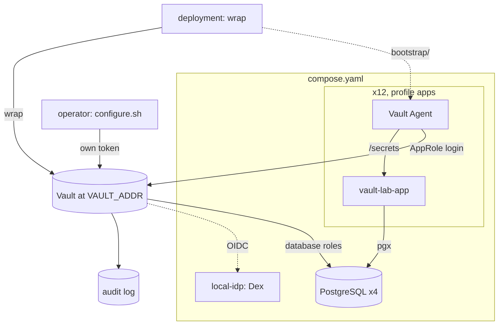

# Overview

This document describes what `hashicorp-vault-lab` is made of and why it
exists. For how to bring it up, see [`../README.md`](../README.md).

## Why this exists

Vault's documentation explains its features. What it cannot explain is how to
apply them to *your* organization, because that depends on decisions only you
can make. Those decisions have an unusual property: **nothing in normal
operation tells you whether you got them right.** A bad label design makes
queries slow. A bad subject split produces nothing at all until something
leaks, which is rare.

This lab is a place to grade those decisions before they are graded for you.
Twelve applications run against a real Vault. You stop one and watch what falls
with it.

Bringing the lab up and poking at it without a question first is possible and
produces a lot of interesting output. It does not produce a conclusion.

## Goals

- Provide a working dataplane in which 12 applications use Vault concurrently
  with the patterns a real medium-sized organization would use:
  AppRole + response wrapping, OIDC operator login, dynamic database
  credentials with pool rotation, a two-tier PKI, audit logging, and TLS.
- Give the seven decisions in [DECIDING.md](DECIDING.md) somewhere to be
  tested, and record one worked answer to them in
  [RATIONALE.md](RATIONALE.md).

## Non-goals

These belong to whoever runs the Vault the lab uses (with
[hashicorp-vault-sandbox](https://github.com/zinrai/hashicorp-vault-sandbox),
that repository):

- Vault cluster operations (HA, storage, seal/unseal and the custody of the
  keys behind it).
- Ceremonies such as `vault operator generate-root` and rekey, driven by key
  quorum.
- Vault listener TLS (the PKI hierarchy in this lab is exercised for
  application certificates, not for Vault's own listener).
- Vault version upgrades / migrations.
- Kubernetes integration.

## Architecture

The lab runs on a Vault it does not operate, reachable at `VAULT_ADDR` and
verified against `VAULT_CACERT`; with hashicorp-vault-sandbox, its Workload
Vault. An operator of that Vault runs `vault-config/configure.sh` with their
own token to configure the lab. The deployment, played by `wrap` in the
README, then response-wraps every per-app role-id and a new secret-id and hands
them to the agents. Each agent unwraps its pair at first start and exec's
`vault agent`. The wrap is single-use, so an agent restart fails by design.
Full reasoning in
[RATIONALE.md](RATIONALE.md#bootstrap-shape-response-wrap-with-tmpfs).

The containers are defined in this repository's `compose.yaml`, a Compose
project of its own. Without a profile it starts the four Postgres databases and
`local-idp`; profile `apps` adds the twelve agent and application pairs. All of
them join `VAULT_NETWORK`, an external Docker network that the Vault nodes are
on, so the nodes reach the databases and `local-idp` by name. The agents get
`VAULT_ADDR` from the environment and the file `VAULT_CACERT` mounted as their
CA, and their wrap tokens from `bootstrap/<app>/`, mounted at
`/vault-bootstrap/<app>/`.

## Components

### Applications (12)

| # | Name              | Vault inputs                                                  |
|---|-------------------|---------------------------------------------------------------|
| 1 | web-frontend      | KV `secret/config`, DB `main-readonly`                        |
| 2 | api-server        | KV `secret/api-server/*`, DB `main-readwrite`                 |
| 3 | admin-panel       | DB `main-readonly`, PKI `admin-panel` (issued by `pki_int`)   |
| 4 | auth-service      | KV `secret/auth-service/*`, DB `main-readwrite`               |
| 5 | payment           | KV `secret/payment/*`, DB `payment-short` (10m TTL)           |
| 6 | notification      | KV `secret/notification/*`                                    |
| 7 | search            | DB `main-readonly`                                            |
| 8 | batch-runner      | DB `main-readwrite`, DB `analytics-readwrite`                 |
| 9 | etl               | DB `main-long` (8h TTL), DB `analytics-readwrite`             |
| 10| analytics         | DB `analytics-readonly`                                       |
| 11| webhook-receiver  | KV `secret/webhook-receiver/*`, DB `main-readwrite`           |
| 12| internal-cms      | KV `secret-internal/internal-cms/*`, DB `internal-readwrite`  |

Every application is its own AppRole subject, but several share a credential
template. `main-readwrite` is used by four of them. Those are two different
granularity axes, and the difference is visible in
[EXPLORING 8.3](EXPLORING.md#83-revoke-a-dynamic-db-lease).

Each application is a pair of containers sharing a per-app named volume:

- `app-<name>-agent` (`hashicorp/vault:2.1.1`) runs `vault agent` after
  unwrapping its wrap tokens from `/vault-bootstrap/<name>/`. Reads
  `vault-agent-configs/<name>.hcl`, which has no `vault {}` stanza:
  `VAULT_ADDR` and `VAULT_CACERT` come from the deployment's environment.
  `compose.yaml` passes `VAULT_ADDR` through and mounts the host file
  `VAULT_CACERT` as the agent's CA.
- `app-<name>` runs `vault-lab-app`, the lab's single Go binary, in the
  image `compose.yaml` builds from `app/`, with `apps/<name>.yaml`. It watches `/secrets/*.json` and rotates its
  `pgxpool`, KV state, and PKI cert observation on file change.

### local-idp

[Dex](https://dexidp.io/) (`ghcr.io/dexidp/dex:v2.45.1`) at `local-idp:5556` on
`VAULT_NETWORK`, and published on `127.0.0.1:5556` of the Docker host for the
browser, configured by `local-idp/config.yaml`. Issuer `http://local-idp:5556/dex`, one
client `vault` with the CLI callback `http://localhost:8250/oidc/callback`, and
two users, `sre@example.local` / `srepass` and `developer@example.local` /
`devpass`. Reasoning in [RATIONALE.md](RATIONALE.md#local-idp-is-dex).

### Vault configuration

What the Vault provides, not the lab:

- **Listener**: TLS, with the CA in `VAULT_CACERT`.
- **Audit**: an audit device enabled by the Vault's operators, not by the
  lab. [EXPLORING.md](EXPLORING.md#6-audit-log) assumes a file device at
  `/vault/logs/audit.log` on each node, written by the active node.

What `vault-config/configure.sh` writes:

- **Auth methods**: `approle/` (machines), `oidc/` (humans).
- **Secrets engines**: `secret/` (KV v2), `secret-internal/` (KV v2),
  `database/` (max-lease-ttl 24h), `pki/` (root), `pki_int/` (intermediate).
- **PKI**: two-tier. `pki/` issues only the intermediate CA cert;
  `pki_int/admin-panel` issues 1h application certificates.
- **Policies**: `self-renewal` (own token and leases), `sre-admin`,
  `developer-readonly`, `incident-response`, and one policy per application,
  from `vault-config/policies/`.
- **OIDC roles**: `sre` (8h, max 24h), `developer` (8h, max 24h), `incident`
  (30m, max 1h). All bind `user_claim=email`.
- **AppRole roles**: one per application, `token_ttl=20m`, `token_max_ttl=2h`,
  `secret_id_ttl=720h`, `secret_id_num_uses=0`.
- **Database connections**: `postgres-main`, `postgres-payment`,
  `postgres-analytics`, `postgres-internal`. Vault rotates its own connection
  password when `configure.sh` first writes each connection, so the seed
  credentials in `configure.sh` are immediately invalidated.
- **Database roles**: `main-readonly`, `main-readwrite`, `main-short` (15m),
  `main-long` (8h), `payment-short` (10m), `analytics-readonly`,
  `analytics-readwrite`, `analytics-long`, `internal-readwrite`.

`configure.sh` is safe to run again. It does not enable audit, does not touch a
root token, and does not issue secret-ids: handing those to the agents is the
deployment's job.

## Lab simplifications

Deliberate scope choices that diverge from a production deployment:

- The Vault is run by someone else; with hashicorp-vault-sandbox, on the same
  host as a practice environment. This lab configures and uses it; it does not
  operate it.
- All lab containers run as root. The rendered files use `perms = "0400"` but
  live under root ownership. The file-rather-than-env-var pattern, which is the
  actual teaching point, is preserved.
- Postgres connections from apps use `sslmode=disable`. Production would
  terminate TLS at the database listener as well.
- `local-idp` has two static users. Group claims and external-group mapping
  are not exercised.
- The OIDC roles are not bound to a subject, so either IdP user can select any
  of the three. In production the role a person may assume is bound to their
  identity, and `incident` in particular would be a break-glass path with
  detection attached.
- `local-idp` registers only the CLI callback; the lab uses no Vault UI.
  `vault login -method=oidc` works; there is no Vault UI login page.
- Operator tokens carry Vault's built-in `default` policy, which cannot be
  renamed and is not defined in this repository. Application tokens set
  `token_no_default_policy=true` and carry only `self-renewal` plus their own,
  so `vault token lookup` on a machine token names only files you can read
  here. Reasoning in
  [RATIONALE.md](RATIONALE.md#application-tokens-carry-no-implicit-policy).
